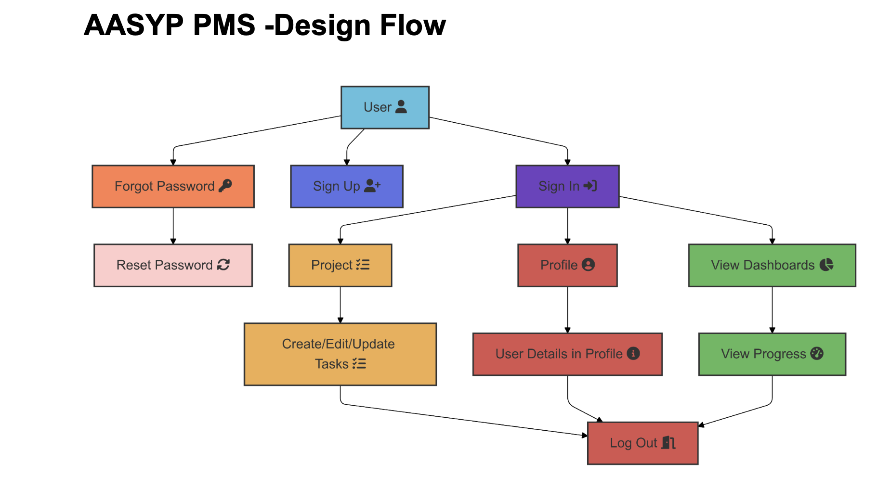
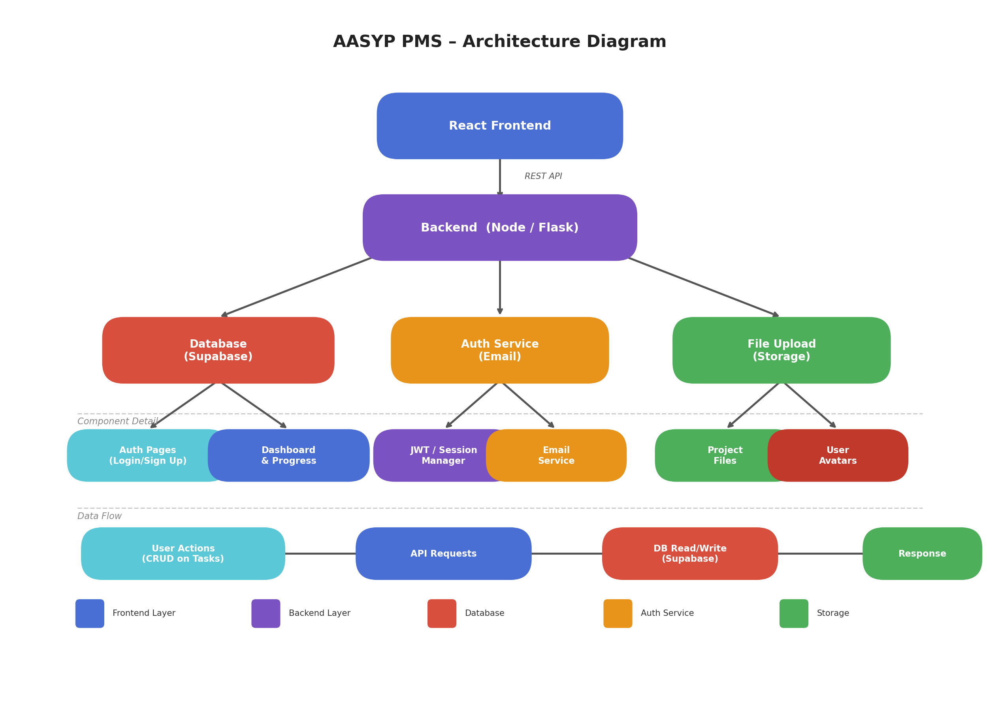
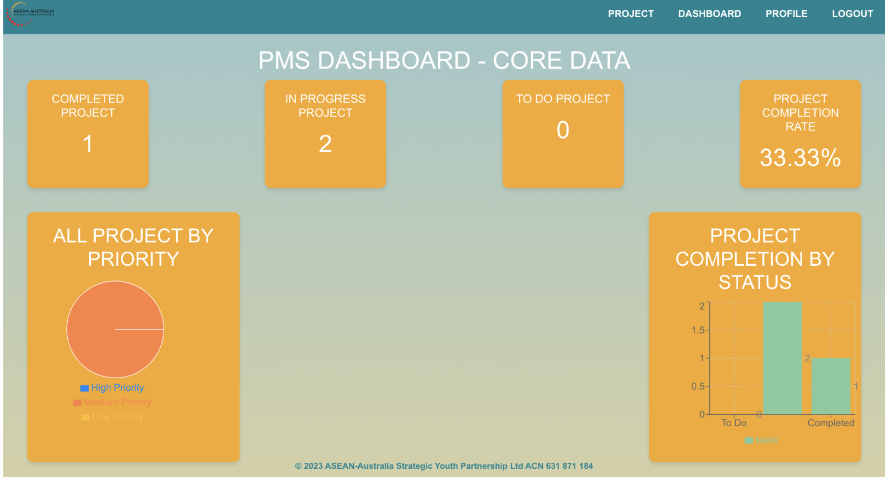
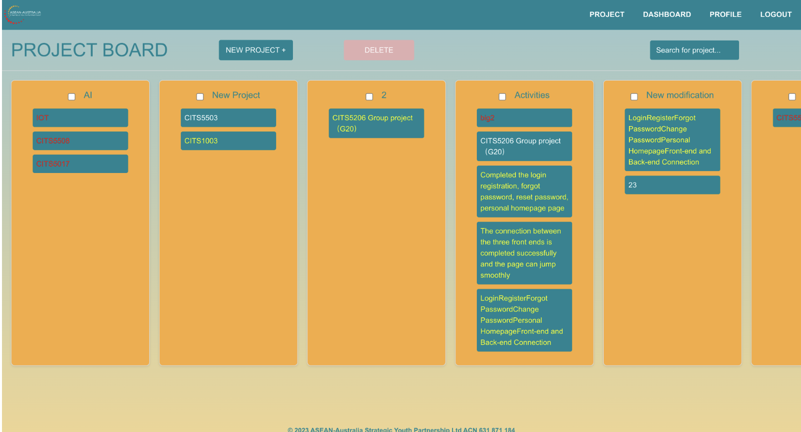
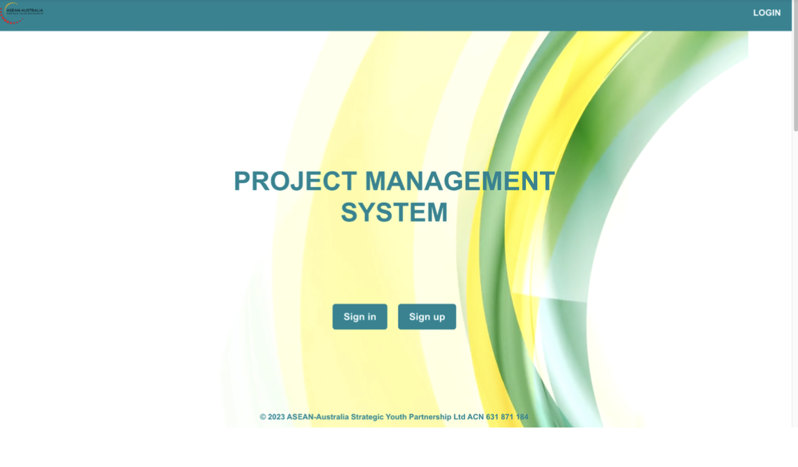

# AASyP Project Management System (PMS)

A professional, role-based project management solution designed to streamline team collaboration, task tracking, and data visualization.

---

## 🔒 Confidentiality Notice
**Source Code Status: Private / Restricted** Due to non-disclosure agreements (NDA) and project security protocols, the source code of this repository is not public. This repository serves as a **Portfolio Showcase**, documenting the system's architecture, UI/UX design, and core technical implementation logic.

---

## 🚀 Key Features

- **Dynamic Dashboard:** Provides a high-level overview of project milestones, task distribution, and team productivity metrics.
- **Granular Task Management:** Supports complex task lifecycles, including allocation, priority leveling, and real-time status updates.
- **Role-Based Access Control (RBAC):** A secure permission system ensuring that users only access data relevant to their specific roles.
- **Data-Driven Insights:** Integrated charts and visual tools to monitor progress and identify potential bottlenecks.

---

## 🛠 Tech Stack

- **Frontend:** React.js, Tailwind CSS, Framer Motion (for smooth UI transitions)
- **Backend:** Node.js / Express (or specify your actual backend)
- **Database:** PostgreSQL / MongoDB (or specify your actual database)
- **Workflow:** Git-based collaboration, Vercel/GitHub CI/CD deployment.

---

## 🏗 System Architecture & Design

### 1. System Logic & User Flow
We prioritized a seamless user experience by mapping out detailed user journeys to minimize operational friction.

### 2. Architecture Design
The system follows a modular architecture to ensure scalability and ease of maintenance.

---

## 📸 Interface Showcase

### Dashboard Interface
The dashboard provides a comprehensive view of all ongoing activities.

### Task Management Module
Focuses on clarity and efficiency for daily operations.

### Secure Authentication
Professional entry point with multi-role support.

---

## 👨‍💻 Development Highlights

- **UI/UX Excellence:** Implemented a clean, modern interface using Tailwind CSS, focusing on professional aesthetics and readability.
- **Optimization:** Handled complex state management for task tracking to ensure a responsive user experience.
- **Documentation:** Maintained rigorous documentation of system flows and architectural patterns.

---

## ✉️ Contact
For inquiries regarding the technical implementation, detailed project documentation, or a private live demo, please feel free to reach out.

**Author:** Rebecca Chen  
**Portfolio:** [https://rebecca-portfolio-phi.vercel.app/]
